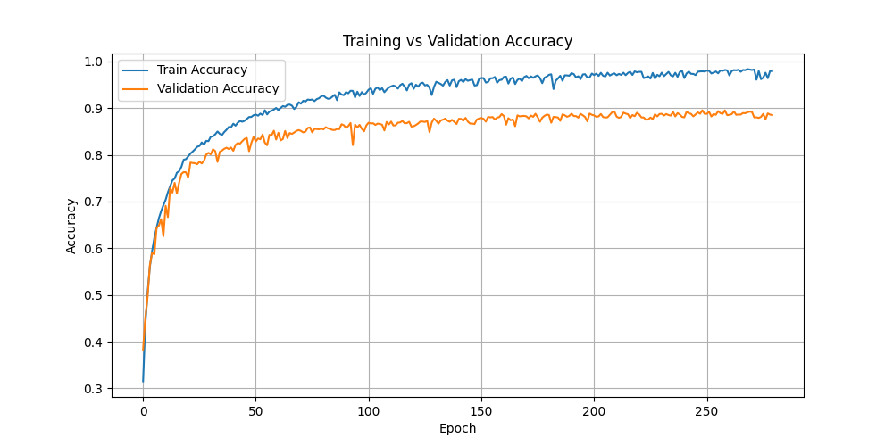
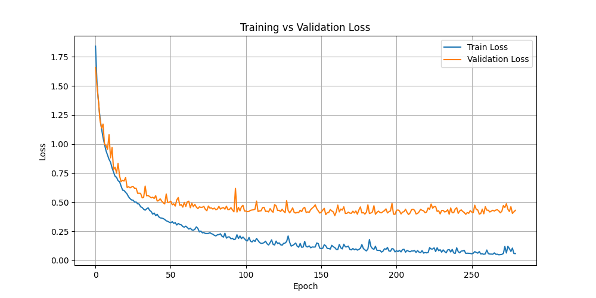
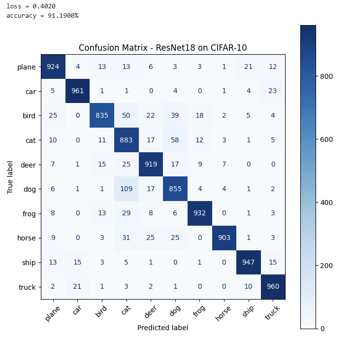

# 🧠 CIFAR-10 Classification using ResNet-18

Dự án này huấn luyện mô hình **ResNet-18** để phân loại ảnh trong bộ dữ liệu **CIFAR-10** gồm 10 lớp:  
`['airplane', 'automobile', 'bird', 'cat', 'deer', 'dog', 'frog', 'horse', 'ship', 'truck']`.

---

## 🚀 1. Giới thiệu

Mục tiêu: Xây dựng mô hình nhận dạng ảnh nhỏ (32x32) bằng mạng CNN mạnh mẽ ResNet-18.  
Mô hình được huấn luyện bằng **PyTorch** với các bước tiền xử lý cơ bản (normalize, augmentations).

---

## 📊 2. Kết quả
Độ chính xác đạt được

Train Accuracy: ~92%

Validation Accuracy: ~88%

Test Accuracy: ~91%
## 📈 Biểu đồ Accuracy

  

Hình 1: Biểu đồ thể hiện quá trình thay đổi Accuracy các epoch.

## 📈 Biểu đồ Loss

  

Hình 2: Biểu đồ thể hiện quá trình thay đổi Loss qua các epoch.

## 🧩 Confusion Matrix

  

Hình 3: Ma trận nhầm lẫn thể hiện mức độ chính xác của mô hình trên từng lớp CIFAR-10.
